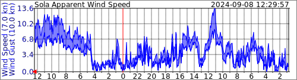

# InfluxDBWindSVG
Retrieves Apparent Wind Data from Influx database and writes it to MRTG style SVG graphs.



The apparent wind data is inserted into my database from an existing SignalK https://github.com/SignalK instance recieving data from the instruments on my boat.

## Details

I started all of this trying to use https://www.influxdata.com/blog/getting-started-c-influxdb/ as a starting point.

It required getting https://github.com/offa/influxdb-cxx up and running, which required this as a prerequisite: https://github.com/libcpr/cpr

### Here's a set of commands that can build from scratch
#### cpr
```
git clone https://github.com/libcpr/cpr.git
mkdir cpr/build && pushd cpr/build
cmake .. -DCPR_USE_SYSTEM_CURL=ON
cmake --build .
sudo cmake --install .
popd
```
#### influxdb-cxx
```
git clone https://github.com/offa/influxdb-cxx
mkdir influxdb-cxx/build && pushd influxdb-cxx/build
cmake -D INFLUXCXX_TESTING:BOOL=OFF ..
sudo make install
popd
```
#### InfluxDBWindSVG
```
git clone https://github.com/wcbonner/InfluxDBWindSVG.git
cmake -S InfluxDBWindSVG -B InfluxDBWindSVG/build
pushd InfluxDBWindSVG/build && make && popd
InfluxDBWindSVG/build/influxdbwindsvg
```

### Below is a log of what I did
```
wim@WimPi4-Sola:~ $ git clone https://github.com/libcpr/cpr.git
Cloning into 'cpr'...
remote: Enumerating objects: 8290, done.
remote: Counting objects: 100% (1011/1011), done.
remote: Compressing objects: 100% (454/454), done.
remote: Total 8290 (delta 637), reused 838 (delta 553), pack-reused 7279
Receiving objects: 100% (8290/8290), 1.63 MiB | 5.97 MiB/s, done.
Resolving deltas: 100% (5532/5532), done.
wim@WimPi4-Sola:~ $ cd cpr && mkdir build && cd build
wim@WimPi4-Sola:~/cpr/build $ cmake .. -DCPR_USE_SYSTEM_CURL=ON
-- The CXX compiler identification is GNU 10.2.1
-- Detecting CXX compiler ABI info
-- Detecting CXX compiler ABI info - done
-- Check for working CXX compiler: /usr/bin/c++ - skipped
-- Detecting CXX compile features
-- Detecting CXX compile features - done
-- CXX standard: 17
-- C++ Requests CMake Options
-- =======================================================
--   CPR_GENERATE_COVERAGE: OFF
--   CPR_CURL_NOSIGNAL: OFF
--   CURL_VERBOSE_LOGGING: OFF
--   CPR_USE_SYSTEM_GTEST: OFF
--   CPR_USE_SYSTEM_CURL: ON
--   CPR_ENABLE_CURL_HTTP_ONLY: ON
--   CPR_ENABLE_SSL: ON
--   CPR_FORCE_OPENSSL_BACKEND: OFF
--   CPR_FORCE_WINSSL_BACKEND: OFF
--   CPR_FORCE_DARWINSSL_BACKEND: OFF
--   CPR_FORCE_MBEDTLS_BACKEND: OFF
--   CPR_ENABLE_LINTING: OFF
--   CPR_ENABLE_CPPCHECK: OFF
--   CPR_BUILD_TESTS: OFF
--   CPR_BUILD_TESTS_SSL: OFF
--   CPR_BUILD_TESTS_PROXY: OFF
--   CPR_SKIP_CA_BUNDLE_SEARCH: OFF
--   CPR_USE_BOOST_FILESYSTEM: OFF
--   CPR_DEBUG_SANITIZER_FLAG_THREAD: OFF
--   CPR_DEBUG_SANITIZER_FLAG_ADDR: OFF
--   CPR_DEBUG_SANITIZER_FLAG_LEAK: OFF
--   CPR_DEBUG_SANITIZER_FLAG_UB: OFF
--   CPR_DEBUG_SANITIZER_FLAG_ALL: OFF
-- =======================================================
-- Performing Test THREAD_SANITIZER_AVAILABLE
-- Performing Test THREAD_SANITIZER_AVAILABLE - Success
-- Performing Test ADDRESS_SANITIZER_AVAILABLE
-- Performing Test ADDRESS_SANITIZER_AVAILABLE - Success
-- Performing Test LEAK_SANITIZER_AVAILABLE
-- Performing Test LEAK_SANITIZER_AVAILABLE - Success
-- Performing Test UNDEFINED_BEHAVIOUR_SANITIZER_AVAILABLE
-- Performing Test UNDEFINED_BEHAVIOUR_SANITIZER_AVAILABLE - Success
-- Performing Test ALL_SANITIZERS_AVAILABLE
-- Performing Test ALL_SANITIZERS_AVAILABLE - Success
-- Automatically detecting SSL backend.
-- Detecting SSL backend...
-- Found OpenSSL: /usr/lib/aarch64-linux-gnu/libcrypto.so (found version "1.1.1n")
-- SSL auto detect: Using OpenSSL.
-- Found CURL: /usr/lib/aarch64-linux-gnu/libcurl.so (found version "7.74.0") found components: HTTP HTTPS
-- Curl 7.74.0 found on this system.
-- Configuring done
-- Generating done
-- Build files have been written to: /home/wim/cpr/build
wim@WimPi4-Sola:~/cpr/build $ cmake --build .
Scanning dependencies of target cpr
[  3%] Building CXX object cpr/CMakeFiles/cpr.dir/accept_encoding.cpp.o
[  6%] Building CXX object cpr/CMakeFiles/cpr.dir/async.cpp.o
[ 10%] Building CXX object cpr/CMakeFiles/cpr.dir/auth.cpp.o
[ 13%] Building CXX object cpr/CMakeFiles/cpr.dir/bearer.cpp.o
[ 17%] Building CXX object cpr/CMakeFiles/cpr.dir/callback.cpp.o
[ 20%] Building CXX object cpr/CMakeFiles/cpr.dir/cert_info.cpp.o
[ 24%] Building CXX object cpr/CMakeFiles/cpr.dir/cookies.cpp.o
[ 27%] Building CXX object cpr/CMakeFiles/cpr.dir/cprtypes.cpp.o
[ 31%] Building CXX object cpr/CMakeFiles/cpr.dir/curl_container.cpp.o
[ 34%] Building CXX object cpr/CMakeFiles/cpr.dir/curlholder.cpp.o
[ 37%] Building CXX object cpr/CMakeFiles/cpr.dir/error.cpp.o
[ 41%] Building CXX object cpr/CMakeFiles/cpr.dir/file.cpp.o
[ 44%] Building CXX object cpr/CMakeFiles/cpr.dir/multipart.cpp.o
[ 48%] Building CXX object cpr/CMakeFiles/cpr.dir/parameters.cpp.o
[ 51%] Building CXX object cpr/CMakeFiles/cpr.dir/payload.cpp.o
[ 55%] Building CXX object cpr/CMakeFiles/cpr.dir/proxies.cpp.o
[ 58%] Building CXX object cpr/CMakeFiles/cpr.dir/proxyauth.cpp.o
[ 62%] Building CXX object cpr/CMakeFiles/cpr.dir/session.cpp.o
[ 65%] Building CXX object cpr/CMakeFiles/cpr.dir/threadpool.cpp.o
[ 68%] Building CXX object cpr/CMakeFiles/cpr.dir/timeout.cpp.o
[ 72%] Building CXX object cpr/CMakeFiles/cpr.dir/unix_socket.cpp.o
[ 75%] Building CXX object cpr/CMakeFiles/cpr.dir/util.cpp.o
[ 79%] Building CXX object cpr/CMakeFiles/cpr.dir/response.cpp.o
[ 82%] Building CXX object cpr/CMakeFiles/cpr.dir/redirect.cpp.o
[ 86%] Building CXX object cpr/CMakeFiles/cpr.dir/interceptor.cpp.o
[ 89%] Building CXX object cpr/CMakeFiles/cpr.dir/ssl_ctx.cpp.o
[ 93%] Building CXX object cpr/CMakeFiles/cpr.dir/curlmultiholder.cpp.o
[ 96%] Building CXX object cpr/CMakeFiles/cpr.dir/multiperform.cpp.o
[100%] Linking CXX shared library ../lib/libcpr.so
[100%] Built target cpr
wim@WimPi4-Sola:~/cpr/build $ sudo cmake --install .
-- Install configuration: ""
-- Installing: /usr/local/lib/aarch64-linux-gnu/libcpr.so.1.11.0
-- Installing: /usr/local/lib/aarch64-linux-gnu/libcpr.so.1
-- Installing: /usr/local/lib/aarch64-linux-gnu/libcpr.so
-- Installing: /usr/local/lib/aarch64-linux-gnu/cmake/cpr/cprTargets.cmake
-- Installing: /usr/local/lib/aarch64-linux-gnu/cmake/cpr/cprTargets-noconfig.cmake
-- Installing: /usr/local/lib/aarch64-linux-gnu/cmake/cpr/cprConfig.cmake
-- Installing: /usr/local/lib/aarch64-linux-gnu/cmake/cpr/cprConfigVersion.cmake
-- Installing: /usr/local/include/cpr
-- Installing: /usr/local/include/cpr/cookies.h
-- Installing: /usr/local/include/cpr/response.h
-- Installing: /usr/local/include/cpr/limit_rate.h
-- Installing: /usr/local/include/cpr/local_port_range.h
-- Installing: /usr/local/include/cpr/multipart.h
-- Installing: /usr/local/include/cpr/threadpool.h
-- Installing: /usr/local/include/cpr/connect_timeout.h
-- Installing: /usr/local/include/cpr/cert_info.h
-- Installing: /usr/local/include/cpr/accept_encoding.h
-- Installing: /usr/local/include/cpr/cpr.h
-- Installing: /usr/local/include/cpr/local_port.h
-- Installing: /usr/local/include/cpr/proxies.h
-- Installing: /usr/local/include/cpr/ssl_ctx.h
-- Installing: /usr/local/include/cpr/callback.h
-- Installing: /usr/local/include/cpr/ssl_options.h
-- Installing: /usr/local/include/cpr/cprtypes.h
-- Installing: /usr/local/include/cpr/http_version.h
-- Installing: /usr/local/include/cpr/async.h
-- Installing: /usr/local/include/cpr/unix_socket.h
-- Installing: /usr/local/include/cpr/bearer.h
-- Installing: /usr/local/include/cpr/verbose.h
-- Installing: /usr/local/include/cpr/reserve_size.h
-- Installing: /usr/local/include/cpr/redirect.h
-- Installing: /usr/local/include/cpr/body.h
-- Installing: /usr/local/include/cpr/status_codes.h
-- Installing: /usr/local/include/cpr/file.h
-- Installing: /usr/local/include/cpr/curlmultiholder.h
-- Installing: /usr/local/include/cpr/session.h
-- Installing: /usr/local/include/cpr/resolve.h
-- Installing: /usr/local/include/cpr/buffer.h
-- Installing: /usr/local/include/cpr/interceptor.h
-- Installing: /usr/local/include/cpr/api.h
-- Installing: /usr/local/include/cpr/singleton.h
-- Installing: /usr/local/include/cpr/multiperform.h
-- Installing: /usr/local/include/cpr/curl_container.h
-- Installing: /usr/local/include/cpr/curlholder.h
-- Installing: /usr/local/include/cpr/auth.h
-- Installing: /usr/local/include/cpr/parameters.h
-- Installing: /usr/local/include/cpr/error.h
-- Installing: /usr/local/include/cpr/range.h
-- Installing: /usr/local/include/cpr/util.h
-- Installing: /usr/local/include/cpr/async_wrapper.h
-- Installing: /usr/local/include/cpr/interface.h
-- Installing: /usr/local/include/cpr/filesystem.h
-- Installing: /usr/local/include/cpr/payload.h
-- Installing: /usr/local/include/cpr/user_agent.h
-- Installing: /usr/local/include/cpr/proxyauth.h
-- Installing: /usr/local/include/cpr/timeout.h
-- Installing: /usr/local/include/cpr/low_speed.h
-- Up-to-date: /usr/local/include/cpr
-- Installing: /usr/local/include/cpr/cprver.h
```

and then

```
wim@WimPi4-Sola:~ $ git clone https://github.com/offa/influxdb-cxx
Cloning into 'influxdb-cxx'...
remote: Enumerating objects: 2658, done.
remote: Counting objects: 100% (2658/2658), done.
remote: Compressing objects: 100% (828/828), done.
remote: Total 2658 (delta 1760), reused 2587 (delta 1721), pack-reused 0
Receiving objects: 100% (2658/2658), 443.68 KiB | 2.26 MiB/s, done.
Resolving deltas: 100% (1760/1760), done.
wim@WimPi4-Sola:~ $ cd influxdb-cxx/
wim@WimPi4-Sola:~/influxdb-cxx $ mkdir build && cd build
wim@WimPi4-Sola:~/influxdb-cxx/build $ cmake -D INFLUXCXX_TESTING:BOOL=OFF ..
-- The CXX compiler identification is GNU 10.2.1
-- Detecting CXX compiler ABI info
-- Detecting CXX compiler ABI info - done
-- Check for working CXX compiler: /usr/bin/c++ - skipped
-- Detecting CXX compile features
-- Detecting CXX compile features - done
-- ~~~ influxdb-cxx v0.7.1 ~~~
-- Build Type : RelWithDebInfo
-- Boost support : ON
-- Unit Tests : OFF
-- System Tests : ON
-- Looking for C++ include pthread.h
-- Looking for C++ include pthread.h - found
-- Performing Test CMAKE_HAVE_LIBC_PTHREAD
-- Performing Test CMAKE_HAVE_LIBC_PTHREAD - Failed
-- Looking for pthread_create in pthreads
-- Looking for pthread_create in pthreads - not found
-- Looking for pthread_create in pthread
-- Looking for pthread_create in pthread - found
-- Found Threads: TRUE
-- Found CURL: /usr/lib/aarch64-linux-gnu/libcurl.so (found version "7.74.0")
-- Found Boost: /usr/lib/aarch64-linux-gnu/cmake/Boost-1.74.0/BoostConfig.cmake (found version "1.74.0") found components: system
-- Performing Test COMPILER_HAS_HIDDEN_VISIBILITY
-- Performing Test COMPILER_HAS_HIDDEN_VISIBILITY - Success
-- Performing Test COMPILER_HAS_HIDDEN_INLINE_VISIBILITY
-- Performing Test COMPILER_HAS_HIDDEN_INLINE_VISIBILITY - Success
-- Performing Test COMPILER_HAS_DEPRECATED_ATTR
-- Performing Test COMPILER_HAS_DEPRECATED_ATTR - Success
-- Configuring done
-- Generating done
-- Build files have been written to: /home/wim/influxdb-cxx/build
wim@WimPi4-Sola:~/influxdb-cxx/build $ sudo make install
Scanning dependencies of target InfluxDB-Core
[  9%] Building CXX object src/CMakeFiles/InfluxDB-Core.dir/InfluxDB.cxx.o
[ 18%] Building CXX object src/CMakeFiles/InfluxDB-Core.dir/Point.cxx.o
[ 27%] Building CXX object src/CMakeFiles/InfluxDB-Core.dir/InfluxDBFactory.cxx.o
[ 36%] Building CXX object src/CMakeFiles/InfluxDB-Core.dir/Proxy.cxx.o
[ 36%] Built target InfluxDB-Core
Scanning dependencies of target InfluxDB-Internal
[ 45%] Building CXX object src/CMakeFiles/InfluxDB-Internal.dir/LineProtocol.cxx.o
[ 54%] Building CXX object src/CMakeFiles/InfluxDB-Internal.dir/HTTP.cxx.o
[ 54%] Built target InfluxDB-Internal
Scanning dependencies of target InfluxDB-BoostSupport
[ 63%] Building CXX object src/CMakeFiles/InfluxDB-BoostSupport.dir/BoostSupport.cxx.o
In file included from /usr/include/boost/smart_ptr/detail/sp_thread_sleep.hpp:22,
                 from /usr/include/boost/smart_ptr/detail/yield_k.hpp:23,
                 from /usr/include/boost/smart_ptr/detail/spinlock_gcc_atomic.hpp:14,
                 from /usr/include/boost/smart_ptr/detail/spinlock.hpp:42,
                 from /usr/include/boost/smart_ptr/detail/spinlock_pool.hpp:25,
                 from /usr/include/boost/smart_ptr/shared_ptr.hpp:29,
                 from /usr/include/boost/shared_ptr.hpp:17,
                 from /usr/include/boost/date_time/time_clock.hpp:17,
                 from /usr/include/boost/date_time/posix_time/posix_time_types.hpp:10,
                 from /usr/include/boost/asio/time_traits.hpp:23,
                 from /usr/include/boost/asio/detail/timer_queue_ptime.hpp:22,
                 from /usr/include/boost/asio/detail/deadline_timer_service.hpp:29,
                 from /usr/include/boost/asio/basic_deadline_timer.hpp:25,
                 from /usr/include/boost/asio.hpp:25,
                 from /home/wim/influxdb-cxx/src/UDP.h:33,
                 from /home/wim/influxdb-cxx/src/BoostSupport.cxx:25:
/usr/include/boost/bind.hpp:36:1: note: ‘#pragma message: The practice of declaring the Bind placeholders (_1, _2, ...) in the global namespace is deprecated. Please use <boost/bind/bind.hpp> + using namespace boost::placeholders, or define BOOST_BIND_GLOBAL_PLACEHOLDERS to retain the current behavior.’
   36 | BOOST_PRAGMA_MESSAGE(
      | ^~~~~~~~~~~~~~~~~~~~
[ 72%] Building CXX object src/CMakeFiles/InfluxDB-BoostSupport.dir/UDP.cxx.o
[ 81%] Building CXX object src/CMakeFiles/InfluxDB-BoostSupport.dir/TCP.cxx.o
[ 90%] Building CXX object src/CMakeFiles/InfluxDB-BoostSupport.dir/UnixSocket.cxx.o
[ 90%] Built target InfluxDB-BoostSupport
Scanning dependencies of target InfluxDB
[100%] Linking CXX shared library libInfluxDB.so
[100%] Built target InfluxDB
Install the project...
-- Install configuration: "RelWithDebInfo"
-- Installing: /usr/local/lib/aarch64-linux-gnu/libInfluxDB.so.1.0.0
-- Installing: /usr/local/lib/aarch64-linux-gnu/libInfluxDB.so.1
-- Set runtime path of "/usr/local/lib/aarch64-linux-gnu/libInfluxDB.so.1.0.0" to ""
-- Installing: /usr/local/lib/aarch64-linux-gnu/libInfluxDB.so
-- Up-to-date: /usr/local/include
-- Installing: /usr/local/include/Point.h
-- Installing: /usr/local/include/InfluxDBException.h
-- Installing: /usr/local/include/Transport.h
-- Installing: /usr/local/include/Proxy.h
-- Installing: /usr/local/include/InfluxDBFactory.h
-- Installing: /usr/local/include/InfluxDB.h
-- Installing: /usr/local/include/influxdb_export.h
-- Installing: /usr/local/lib/aarch64-linux-gnu/cmake/InfluxDB/InfluxDBTargets.cmake
-- Installing: /usr/local/lib/aarch64-linux-gnu/cmake/InfluxDB/InfluxDBTargets-relwithdebinfo.cmake
-- Installing: /usr/local/lib/aarch64-linux-gnu/cmake/InfluxDB/InfluxDBConfig.cmake
-- Installing: /usr/local/lib/aarch64-linux-gnu/cmake/InfluxDB/InfluxDBConfigVersion.cmake
```
